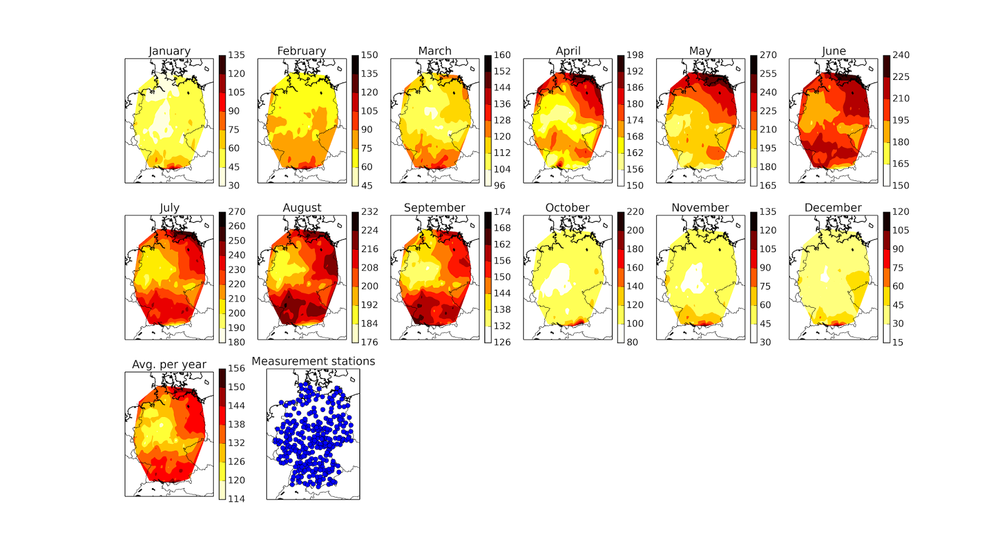
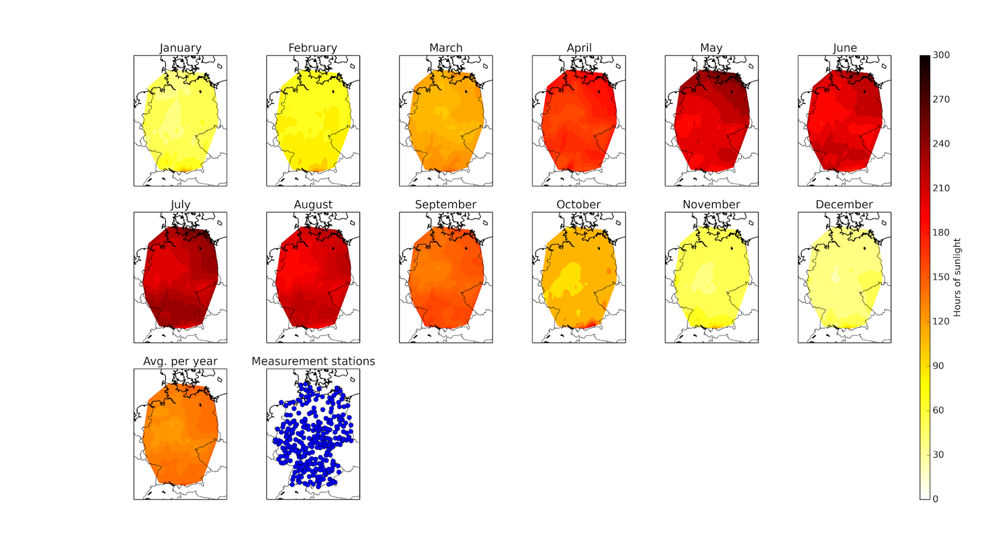

Title: Monthly hours of sunshine maps for Germany
Date: 2013-11-28 08:44
Category: weather
Tags: weather, data, maps, python
Author: syngron (syngron@gmail.com)
Slug: monthly-hours-of-sunshine-maps-for-germany

tl;dr: I created maps with the monthly sunshine hours in Germany by interpolating the data of the German weather service. One graphic shows each month with an individual scale to better compare regions, the other one with a global scale to compare months between each other.

*Monthly sunshine hours in Germany with individual scale.*

*Monthly sunshine hours in Germany with global scale.*
 
Recently I saw this surprising map comparing the sunshine hours of
Europe with the US:  
  
<http://www.reddit.com/r/MapPorn/comments/161j95/europe_vs_the_united_states_sunlight_in_hours_per/>  
  
Any location in the US apparently has much more sunshine than any
location in Germany! Actually this makes sense if you check the latitude
boundaries of the US and Europe but it was never that clear to me.  
  
This made me wonder how the distribution is in Germany and there are
already a couple of maps done for that which are easily found with a
fast internet search.  
 
But then I stumbled upon some nice datasets from the German Weather
Service (DWD, Deutscher Wetterdienst). They actually provide monthly raw
data of sunshine hours for all of their weather stations online :  
  
[Free weather data from the DWD (mean data of 30 year
period)](http://www.dwd.de/bvbw/appmanager/bvbw/dwdwwwDesktop?_nfpb=true&_pageLabel=_dwdwww_klima_umwelt_klimadaten_deutschland&T82002gsbDocumentPath=Navigation%2FOeffentlichkeit%2FKlima__Umwelt%2FKlimadaten%2Fkldaten__kostenfrei%2Fkldat__D__mittelwerte__node.html%3F__nnn%3Dtrue)  
  
I used the [Table A, Sunshine hours (Sonnenscheindauer), years
1981-2010](http://www.dwd.de/bvbw/generator/DWDWWW/Content/Oeffentlichkeit/KU/KU2/KU21/klimadaten/german/sonne__8110__akt__html,templateId=raw,property=publicationFile.html/sonne_8110_akt_html.html).  
  
The data from there can be easily converted into a CSV file by copying
it in a spreadsheet software (e.g. Libreoffice) and save it as CSV.  
  
To further process the data I used python which makes it straight
forward to read CSV files and plot map data with the Basemap library. To
create an evenly distributed grid of data from the not evenly
distributed measurement points I use the matplotlib.mlab.griddata
function and to plot the data on that grid the contourf function. The
code provided in
this [gist](https://gist.github.com/davydany/3789221) (attention, in the
gist the latitude and longitude are switched!) helped a lot.  
  
My final script can be found
here: <https://raw.github.com/syngron/misc/master/DWD_sunshine_hours_Germany.py>  
  
The output of the script is shown in the pictures.  
  
The first one uses a global scale which makes it nice to see the obvious
changes over the seasons of whole Germany.  
  
The second one is even more interesting, here each month has ist own
scale and you can clearly see the regional differences per month. An
interesting point is, that in the summer months the sunlight seems to be
much more evenly distributed apart from the hole in the mid-west. In the
winter month the most southern parts (the region is actually the Allgäu)
seems to get much more sunshine then the whole rest. Probably this is
related to the high altitudes there, the Allgäu stations are just over
the clouds :)  
  
  

  

  
  
  
  
  
  

