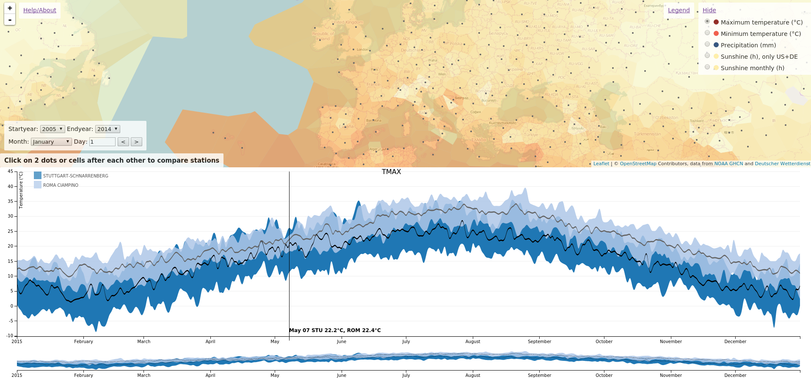

Title: Global weather data comparison
Date: 2016-01-02 10:20
Category: weather
Tags: weather, data, maps, python
Slug: global-weather-data-comparison
Author: syngron (syngron@gmail.com)

tl;dr: I wrote a tool which allows to compare daily temperatures, rainfall and monthly sunshine hours at more than 14.000 locations world-wide. Different days can be shown on an interactive map and two places can be compared directly as time-series: ** [Weather comparison of different cities over time](http://syngron.github.io/syngron-misc/) **

*Screenshot from the weather comparison tool. The map shows the median over the last 10 years of the maximum temperature of January 1. The plot at the bottom compares the maximum temperature of Stuttgart (Germany) and Rome (Italy) over the complete year. The black line shows the 10-year median and the regions around the lines indicate the 10-year minimum and maximum.*

While planning holidays I realized, that there is no decent online tool that I am aware of to compare world-wide climate data from two destinations in one neat plot. 
There seem to be only some sites which provide it for smaller regions like only the US. If you have the choice between two destinations in a given timeframe it could be very helpful to compare those .

**Update:** By now I found out that Wolfram Alpha allows to compare climate data of two cities, but in a non-interactive way and without the map view

There are multiple online weather services like OpenWeatherMap, Weather Underground or forecast. 
All of those have wonderful visualizations of single weather stations and APIs to poll the data. 
However I realized that a one on one comparison between two stations is missing. 
Furthermore pulling historic data from their APIs is not possible for free.
This made me wonder if there is a governmental database of raw historic world-wide **daily** weather data and it turns out there is. 
It is called <a href="http://www.ncdc.noaa.gov/oa/climate/ghcn-daily/", target="_blank">Daily Global Historical Climatology Network (GHCN-DAILY)</a> from the <a href="http://www.noaa.gov/", target="_blank">National Oceanic and Atmospheric Administration (NOAA)</a>.

After downloading data of the last ten years in CSV format for all of their almost 100.000 stations which is around 1.2 GB per year, I started processing it with Python.
Pandas did help a lot to read and transform the large CSV files and I was quickly able to plot statistics for single stations over time with Matplotlib. 
Because I mainly want to know if it makes sense to go to a particluar destination in a given week I then began to calculate median, minimum and maximum values over all 10 years for the data of daily maximum temperature (TMAX), minimum temperature (TMIN) and precipitation (PRCP). 
The data contains various more data fields but many are only available for US stations. 
After some more fiddling in Matplotlib I had some nice comparison plots of all three parameters. Each plot contained the median over the years as a line and the minimum and maximum values as an error region (done with the fill_between matplotlib function). 
With this I was able to manually select two stations and compare them, however I had to load the large CSV data each time beforehand (Python Jupyter notebooks helped here to at least not reload data within one session).

This is when I decided to write a script to reformat the complete data and split it into CSV files per station. 
I did not take all stations, but only the ones which contained at least one TMAX value for the year 2014 which brought the number of stations down from almost 100.000 to 14.261.
After the script ran for a couple of days I ended up with one CSV file per station and measurement (TMAX, TMIN and PRCP) over the last 10 years.

Because I thought that this visualization could be helpful also to other people, I decided to use the JavaScript plotting library <a href="http://d3js.org/", target="_blank">D3</a> to create the plots interactively in the browser upon inserting station ids. 
This method was still quite complicated because you had to know the station id or the coordinates of a station to create the plot. 
Therefore I used the Google Maps API to provide a map with a search field where a user could search a place and I could then use the latitude and longitude to find the closest station for the plotting.

This was already usable but I thought that if I already show a map, it could be actually nice to show the weather statistics for a particular date on that map. 
This reminded me of some JavaScript examples using the mapping library <a href="http://leafletjs.com/", target="_blank">Leaflet</a>. 
So I switched from Google Maps to Leaflet and started plotting each station as a simple circle with the color according to the temperature or precipitation level on the map. 
Upon clicking on the circle, the D3 plot was created for that station.

The circles were not the best solution and so I thought about interpolating the data between stations with Python Matplotlib contourf as I did for the German sunshine hour data (see [Monthly hours of sunshine maps for Germany]({filename}monthly-hours-of-sunshine-maps-for-germany.md)) and reimporting this data into Leaflet. 
Unfortunately I could only visualize the interpolation in Python but ran into some problems to import it into Leaflet, mainly it would require different resolutions for each zoom level. 
My wife proposed to use Voronoi maps and indeed D3 supports that and I found examples using the D3 Voronoi algorithm from the D3 creator <a href="http://bl.ocks.org/mbostock/7608400", target="_blank">Mike Bostock</a>. There was even an example combining D3 Voronoi maps with Leaflet from <a href="http://chriszetter.com/blog/2014/06/15/building-a-voronoi-map-with-D3-and-leaflet/", target="_blank">Chris Zetter</a> which I could use.

Using these examples and creating one CSV file with data from all stations for each day of the year from my previously generated CSV files per station I was able to create the final map showing Voronoi cells, colored depending on the median of the measured temperature or precipitation level at that station at a particular day of the year. 
The span of years used for the median and the month and day can be changed interactively and the map can be zoomed and moved.
Only stations which contain an actual measurement on the selected day are included. 

So far the map works quite well, but does not include a filter for ocean areas, instead I check for a rough grid over the whole globe if there are no stations nearby (thanks to another idea from my wife). If that is the case, I create a fake station with a special id at that grid point. I include those stations in the Voronoi calculations but do not plot any data in their cell. This allows to exclude large areas with no stations but also increases the loading time at the beginning.
Stations are also filtered by space on the map, so that less stations are used when the map is zoomed out. The elevation of stations is used here to still include closeby stations with different altitudes because the weather can change dramatically between a valley and a mountain top.

It is planned to add ocean temperature as an additional layer <s>and add a selection of range of years to use for plotting or to use different statistics as e.g. the mean over the years</s>.

**Update:** By now I did recreate the CSV files so that they include the values per year and the median is calculated with JavaScript on the client side. This allowed to include the year dropdown lists so that the range of years can be specified by the user.

A restriction is the inclusion of data from mountain top stations which then fill a complete voronoi cell although that data is only valid in a very small region on the mountain. A real interpolation of the data with a weighting based on elevation differences could solve this.

In the mean time I found another example where somebody visualized the [Temperature, humidity and wind gusts of USA](http://mashup.mesowest.net/voroWeather.html) in a similar way. However it is restricted to the US and does not plot the station to station comparison.

Check out the application at ** [Weather comparison of different cities over time](http://syngron.github.io/syngron-misc/) ** and give me feedback. Tell me especially if you miss some statistic. The dataset contains various more parameters as for example wind etc.

**Update:** 
Unfortunately the daily sunshine hours from the GHCN dataset are only available for few stations in the US and I could not find another **global and daily** statistic about sunshine hourse. 
However I found that the monthly reports of the <a href="https://www.wmo.int", target="_blank">World Meteorological Organisation (WMO)</a> contains mean sunshine hours per month and that the German weather service <a href="http://www.dwd.de", target="_blank">Deutscher Wetterdienst (DWD)</a> provides a nice interface to them on their FTP server. I wrote additional scripts to create similar CSV files as before and now these data is also available in the application.

**Update:** I now include **daily** sunshine hours from the DWD for German weather stations. In the future I might include additional national data if people tell me where to get the raw data.

**Update:** Instead of the single daily value I use now a rolling mean over seven days. The median over many years should already eliminate outliers of single days but the rolling mean over a short period of days makes this even more stable. Additionally a faster version with a subset of stations can be chosen now for slow internet connections. This includes only stations which have a valid measurement for all years for the specific day. It reduces the file size of one day from 1.4 MB to 0.7 MB.

.
