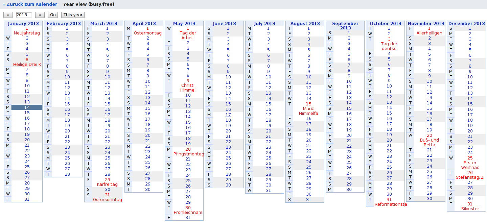

Title: New Google Calendar wall like column year view
Date: 2013-01-14 20:33
Category: web
Tags: calendar
Author: syngron (syngron@gmail.com)
Slug: new-google-calendar-wall-like-column-year-view

tl;dr: I created a Google Calendar plugin to view the whole year with all appointments on one screen, similar to a typical office wall calendar.

Column year view with events in red (German public holidays)

I am a happy [Google Calendar](https://www.google.com/calendar/) user,
however I was always annoyed by two things. One of those things was the
missing year view which I fixed now by programming a new Google Calendar
Gadget which you can find on my Github page. It creates a year view with
each month in one row and all the events from your selected calendars:  
<https://raw.github.com/syngron/misc/master/SyngronYearView.html>  

To add the Gadget to your calendar just follow the link below while you
are logged in to your Google account:  
<https://www.google.com/calendar/render?gadgeturl=https://raw.github.com/syngron/misc/master/SyngronYearView.html>  
  
The other annoying thing is not being able to smoothly scroll between
months in the Google Calendar. At the end of the month I am not
interested in the last four weeks before but more in the coming 4 weeks
but in the online view there is only the static monthly view available
at the moment. That annoyance I could not fix yet.  
  
When I searched for a year view I found out that it was available
through Google Labs as a gadget. Unfortunately I was very disappointed
by it. I was expecting a typical wall calendar like we have it in German
offices many times. These calendars have just 12 columns where each
columns is one month. Each day of the months has a little field to the
right to fill in simple informations or write the important office or
holiday days. The Google Labs year view on the other hand is composed of
a grid with four columns and three rows and each grid cell has the
information of one month with no space for information of events. The
next problem was that not even the days with events were marked
specially. I know already how a year calendar looks, what I do never
remember is where on that calendar I have appointments!  
  
After googling a while I did find at least a version of this year view
calendar with days with events being marked in a different color.
However the event marking did not work properly when I last checked
(found on the
[webbricks](http://blog.grzegorzpawlik.com/2009/11/enhanced-year-view-widget-for-google-calendar/)
blog).  
  
In the end I did not find any solution which resembled my view of a year
view. After studying both codes, the one of the original Google Labs
calendar gadget and the one from webbricks I thought however that I
could try to build my own Gadget with my very rusty Javascript, HTML and
CSS skills and the two templates. You can see the not quite perfect
result in the picture above.  
  
The Gadget works quite good and shows each month in one columns with all
the events of the selected calendars in a separate row of the day just
as I wanted it. But I was still not able to fix the height of the
calendar table columns to an equal size. So months with more days or
more events will be longer than others. Another issue is that if the
screen is too small, months are cut off at the bottom (decreasing the
font size with e.g. CTRL+MINUS can fix that). Another problem that came
up with my real events was, that all events from the first five months
were shown, but sometimes not all of the later months. I poll the
calendar API monthwise and correctly check for events which last over
the time of two different months, maybe the API does not allow too many
polls in a row. I also found out that one single poll for the whole year
does not work. I experimented with window lengths of days and weeks for
polling but they were slower than the month wise polling and resulted in
the same missing events sometimes. If somebody knows why that happens
please tell me.  
  
To sum it up I can say that the Google Calendar Gadgets are a great
option and they can be programmed quite easily if you know web design a
bit. The only problem is the annoying debugging procedure which involves
reinstalling the Gadget after each code change so that the Google cache
is not loading the cached version again. The cache is caching Gadgets
for one hour and for me also the option ?nocache did not help. So it is
best to pre-test Gadgets on your own server before trying them with the
Google Calendar API.  
  

